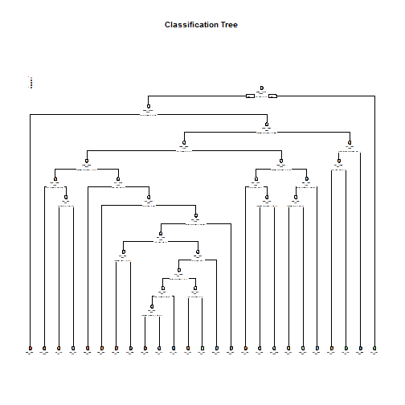

## Practical Machine Learning Training


## Background

Using devices such as Jawbone Up, Nike FuelBand, and Fitbit it is now possible to collect a large amount of data about personal activity relatively inexpensively. These type of devices are part of the quantified self movement - a group of enthusiasts who take measurements about themselves regularly to improve their health, to find patterns in their behavior, or because they are tech geeks. One thing that people regularly do is quantify how much of a particular activity they do, but they rarely quantify how well they do it. In this project, your goal will be to use data from accelerometers on the belt, forearm, arm, and dumbell of 6 participants. They were asked to perform barbell lifts correctly and incorrectly in 5 different ways. More information is available from the website here: http://groupware.les.inf.puc-rio.br/har (see the section on the Weight Lifting Exercise Dataset).

## What you should submit

The goal of your project is to predict the manner in which they did the exercise. This is the "classe" variable in the training set. You may use any of the other variables to predict with. You should create a report describing how you built your model, how you used cross validation, what you think the expected out of sample error is, and why you made the choices you did. You will also use your prediction model to predict 20 different test cases.

## Data Processing

Load the csv file pml-training.csv and pml-testing.csv into R 


```r
training <- read.csv("pml-training.csv", na.strings=c("NA","#DIV/0!",""))
testing <- read.csv("pml-testing.csv", na.strings=c("NA","#DIV/0!",""))
```

Load necessary library


```r
library(caret)
```

```
## Loading required package: lattice
```

```
## Loading required package: ggplot2
```

```
## Need help getting started? Try the cookbook for R:
## http://www.cookbook-r.com/Graphs/
```

```r
library(rpart)
library(rpart.plot)
library(RColorBrewer)

library(randomForest)
```

```
## randomForest 4.6-12
```

```
## Type rfNews() to see new features/changes/bug fixes.
```

```
## 
## Attaching package: 'randomForest'
```

```
## The following object is masked from 'package:ggplot2':
## 
##     margin
```

# Cross-validation

Cross-validation will be performed by subsampling our training data set into 2 subsamples: subTraining data (60% of the original Training data set) and subTesting data (40%). The models will be fitted on the subTraining data set, and tested on the subTesting data. Once the most accurate model is choosen, it will be tested on the original Testing data set.

# Subsampling the data

Partioning  data set into two data sets, 60% for myTraining, 40% for myTesting:


```r
inTrain <- createDataPartition( y=training$classe , p=0.6, list=FALSE)
myTraining <- training[inTrain, ]; myTesting <- training[-inTrain, ]
dim(myTraining)
```

```
## [1] 11776   160
```

```r
dim(myTesting)
```

```
## [1] 7846  160
```

# Cleaning the training data set

Steps to clean the dataset:-

1.Remove the first 7 columns because do not want it to interfere with the algorithm


```r
myTraining <- myTraining[,-c(1:7)]
myTesting <- myTesting[,-c(1:7)]
```

2.Remove columns with many null or zero values


```r
myTraining <- myTraining[,colSums(is.na(myTraining)) == 0]

myTesting <- myTesting[,colSums(is.na(myTesting)) == 0]
```

Lets see the dimension of the 2 dataset


```r
dim(myTraining)
```

```
## [1] 11776    53
```

```r
dim(myTesting)
```

```
## [1] 7846   53
```

# Deciding the best prediction model

After we have clearn the dataset, we will begin to decide which is the best model. We will investigate the 2 prediction model which is decision tree and random forests

1. accuracy of decision tree prediction
---------------------------------------

Using confusionmatrix to test the decision tree prediction model


```r
modFitA1 <- rpart(classe ~ ., data=myTraining, method="class")
rpart.plot(modFitA1, main="Classification Tree", extra=102, under=TRUE, faclen=0)
```



```r
predictionsA1 <- predict(modFitA1, myTesting, type = "class")
confusionMatrix(predictionsA1, myTesting$classe)
```

```
## Confusion Matrix and Statistics
## 
##           Reference
## Prediction    A    B    C    D    E
##          A 1969  231   70   67   49
##          B   62  970  118   42  127
##          C   47  119 1058  209  136
##          D  113  122   84  884   97
##          E   41   76   38   84 1033
## 
## Overall Statistics
##                                           
##                Accuracy : 0.7538          
##                  95% CI : (0.7441, 0.7633)
##     No Information Rate : 0.2845          
##     P-Value [Acc > NIR] : < 2.2e-16       
##                                           
##                   Kappa : 0.688           
##  Mcnemar's Test P-Value : < 2.2e-16       
## 
## Statistics by Class:
## 
##                      Class: A Class: B Class: C Class: D Class: E
## Sensitivity            0.8822   0.6390   0.7734   0.6874   0.7164
## Specificity            0.9257   0.9448   0.9211   0.9366   0.9627
## Pos Pred Value         0.8252   0.7354   0.6743   0.6800   0.8121
## Neg Pred Value         0.9518   0.9160   0.9506   0.9386   0.9378
## Prevalence             0.2845   0.1935   0.1744   0.1639   0.1838
## Detection Rate         0.2510   0.1236   0.1348   0.1127   0.1317
## Detection Prevalence   0.3041   0.1681   0.2000   0.1657   0.1621
## Balanced Accuracy      0.9039   0.7919   0.8473   0.8120   0.8395
```

Decision tree accuracy = 0.7369

2. accuracy of random forests prediction
---------------------------------------

Using confusionmatrix to test the random forests prediction model


```r
modFitB1 <- randomForest(classe ~. , data=myTraining)
predictionsB1 <- predict(modFitB1, myTesting, type = "class")
confusionMatrix(predictionsB1, myTesting$classe)
```

```
## Confusion Matrix and Statistics
## 
##           Reference
## Prediction    A    B    C    D    E
##          A 2228   10    0    2    0
##          B    4 1506    7    0    0
##          C    0    2 1360   21    0
##          D    0    0    1 1261    1
##          E    0    0    0    2 1441
## 
## Overall Statistics
##                                           
##                Accuracy : 0.9936          
##                  95% CI : (0.9916, 0.9953)
##     No Information Rate : 0.2845          
##     P-Value [Acc > NIR] : < 2.2e-16       
##                                           
##                   Kappa : 0.9919          
##  Mcnemar's Test P-Value : NA              
## 
## Statistics by Class:
## 
##                      Class: A Class: B Class: C Class: D Class: E
## Sensitivity            0.9982   0.9921   0.9942   0.9806   0.9993
## Specificity            0.9979   0.9983   0.9964   0.9997   0.9997
## Pos Pred Value         0.9946   0.9927   0.9834   0.9984   0.9986
## Neg Pred Value         0.9993   0.9981   0.9988   0.9962   0.9998
## Prevalence             0.2845   0.1935   0.1744   0.1639   0.1838
## Detection Rate         0.2840   0.1919   0.1733   0.1607   0.1837
## Detection Prevalence   0.2855   0.1933   0.1763   0.1610   0.1839
## Balanced Accuracy      0.9980   0.9952   0.9953   0.9901   0.9995
```

Random forests accuracy = 0.9935

Conclusion: The random forests model is more accurate as it provide an accuracy nearly 100% while decision tree gives a worse accuracy.

# Submission

Generate the submission file based on random forests prediction


```r
predictionsB2 <- predict(modFitB1, testing, type = "class")
pml_write_files = function(x){
  n = length(x)
  for(i in 1:n){
    filename = paste0("problem_id_",i,".txt")
    write.table(x[i],file=filename,quote=FALSE,row.names=FALSE,col.names=FALSE)
  }
}

pml_write_files(predictionsB2)
```


#---------------------------------------------------------


